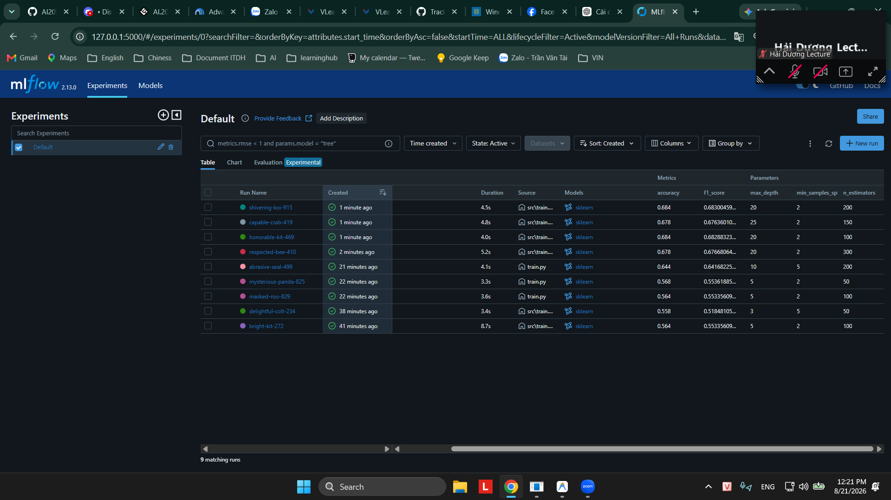
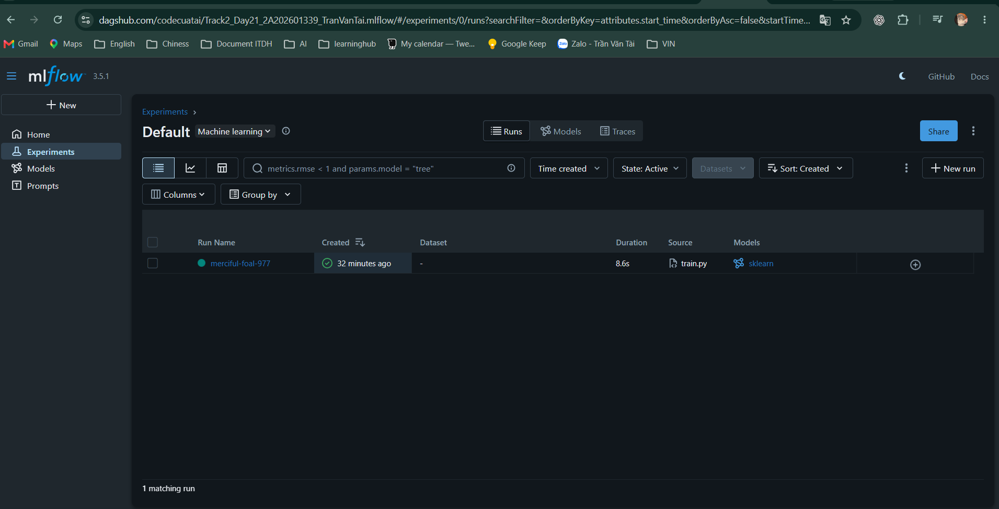
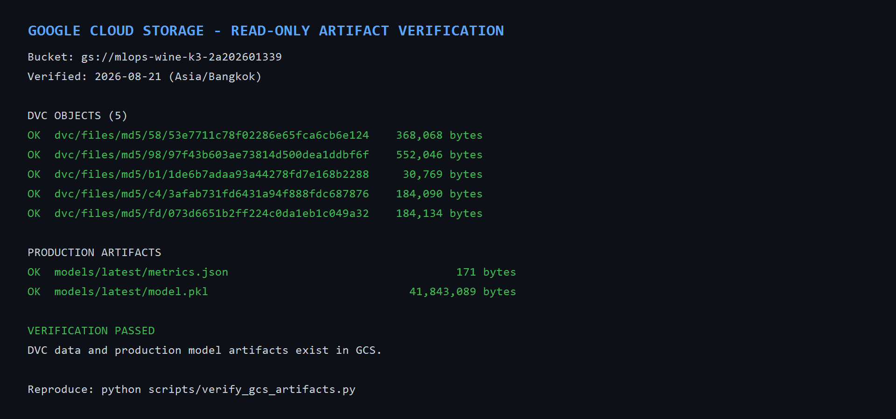
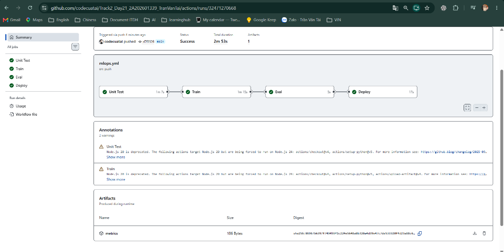
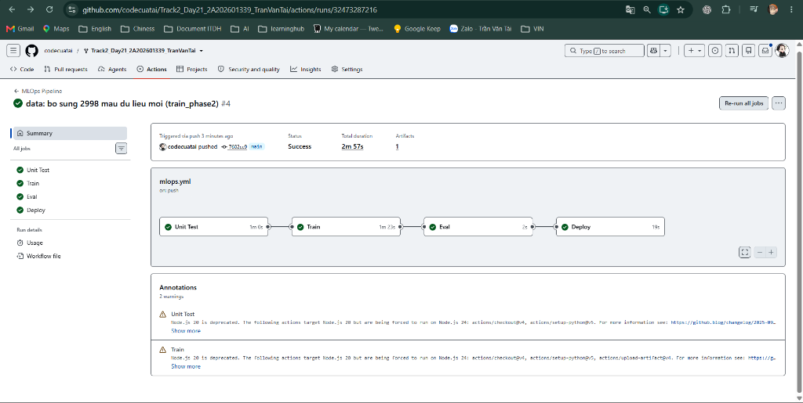

# BÁO CÁO TỔNG KẾT LAB MLOPS END-TO-END (DAY 21)
**Học viên:** Trần Văn Tài | **Mã học viên:** 2A202601339  
**Khoá học:** AIInAction - VinUni (K3) | **Buổi:** Day 21 - CI/CD cho AI Systems  
**GitHub Repository:** https://github.com/codecuatai/Track2_Day21_2A202601339_TranVanTai  
**Cloud Server (GCE VM):** `136.85.48.92:8000` | **GCS Bucket:** `gs://mlops-wine-k3-2a202601339`

---

## 1. Bảng Tổng Hợp Kết Quả Thực Nghiệm MLflow (Bước 1)

9 thí nghiệm được thực hiện trên tập `train_phase1.csv` (2,998 mẫu) và đánh giá trên `eval.csv` (500 mẫu), theo dõi qua **MLflow Tracking (SQLite)**:

| STT | Run Name | `n_estimators` | `max_depth` | `min_samples_split` | Accuracy | F1-Score (Weighted) | Đánh Giá |
| :---: | :--- | :---: | :---: | :---: | :---: | :---: | :--- |
| **1** | `shivering-koi-915` | **200** | **20** | **2** | **0.6840** | **0.6830** | 🏆 **Champion Model (Bước 1 & 2)** |
| 2 | `honorable-kit-469` | 100 | 20 | 2 | 0.6840 | 0.6829 | Tương đương (nhanh hơn) |
| 3 | `respected-bee-410` | 300 | 20 | 2 | 0.6780 | 0.6767 | Tốt |
| 4 | `capable-crab-419` | 150 | 25 | 2 | 0.6780 | 0.6764 | Tốt |
| 5 | `abrasive-seal-499` | 200 | 10 | 5 | 0.6440 | 0.6417 | Khá |
| 6 | `mysterious-panda-825` | 50 | 5 | 2 | 0.5680 | 0.5536 | Trung bình |
| 7 | `masked-roo-829` | 100 | 5 | 2 | 0.5640 | 0.5534 | Baseline chuẩn |
| 8 | `bright-kit-272` | 100 | 5 | 2 | 0.5640 | 0.5534 | Baseline chuẩn |
| 9 | `delightful-colt-234` | 50 | 3 | 5 | 0.5580 | 0.5185 | Underfitting do cây quá nông |

**Bộ tham số tối ưu:** `n_estimators: 200`, `max_depth: 20`, `min_samples_split: 2`.  
**Lý giải:** Cây quyết định sâu `max_depth=20` giúp mô hình nắm bắt đầy đủ các tương tác phi tuyến phức tạp của 12 chỉ số hóa sinh rượu vang. `n_estimators=200` triệt tiêu variance hiệu quả, nâng Accuracy từ 55.8% lên 68.40%.

---

## 2. Bảng So Sánh Hiệu Năng Continuous Training (Bước 2 vs Bước 3)

| Chỉ Số Đánh Giá | Bước 2 (Phase 1: 2,998 mẫu) | Bước 3 (Phase 2: 5,996 mẫu) | Mức Độ Cải Thiện |
| :--- | :---: | :---: | :---: |
| **Số lượng mẫu huấn luyện** | 2,998 mẫu | 5,996 mẫu | Gấp 2 lần (+100%) |
| **Accuracy (Tập đánh giá 500 mẫu)** | **0.6840** (68.40%) | **0.7540** (75.40%) | **+7.00%** |
| **F1-Score (Weighted)** | **0.6830** | **0.7534** | **+0.0704** |
| **Eval Gate (Ngưỡng >= 0.70)** | **Không đạt** ($0.6840 < 0.70$) | **Đạt** ($0.7540 \ge 0.70$) | Chỉ Phase 2 được phép triển khai |

**Kết luận:** Model Phase 1 đạt 68.40% nên bị quality gate 0.70 chặn đúng thiết kế. Khi được bổ sung 2,998 mẫu dữ liệu mới (`train_phase2.csv`), accuracy tăng lên **75.40%**, vượt quality gate và đủ điều kiện so sánh với model production trước khi triển khai.

---

## 3. Kiến Trúc Hạ Tầng & CI/CD Pipeline

1. **Data Versioning (DVC + GCS)**: Dữ liệu lớn được tách rời khỏi Git, lưu trữ an toàn tại `gs://mlops-wine-k3-2a202601339/dvc/` và đồng bộ qua con trỏ `.dvc`.
2. **4-Stage CI/CD Pipeline (GitHub Actions)**:
   - **Job 1 (Unit Test)**: Chạy 8 unit tests (`pytest tests/ -v`) cho training artifacts, quality gate và rollback guardrail.
   - **Job 2 (Train & Push)**: Auth Service Account $\rightarrow$ `dvc pull` $\rightarrow$ `train.py` $\rightarrow$ đẩy model vào vùng `models/candidates/<GITHUB_SHA>/`.
   - **Job 3 (Eval Gate)**: Yêu cầu accuracy $\ge 0.70$ và không thấp hơn model production; pipeline dừng ngay nếu vi phạm.
   - **Job 4 (Deploy)**: Chỉ sau khi Eval thành công mới promote candidate thành `models/latest/`, SSH vào GCE VM, restart `mlops-serve.service` và xác nhận Health Check.
3. **Serving API**: FastAPI daemonized bằng `systemd` trên Ubuntu 22.04 LTS, phục vụ suy luận thời gian thực tại `http://136.85.48.92:8000`.

---

## 4. Xử Lý Khó Khăn & Sự Cố Kỹ Thuật

* **Sự cố 1 (Môi trường Python 3.12 & MLflow)**: `setuptools >= 80` không chứa `pkg_resources` $\rightarrow$ Cài đặt `setuptools-71.1.0` để tương thích hoàn hảo với MLflow backend SQLite.
* **Sự cố 2 (Quyền truy cập Cloud Storage Least-Privilege)**: Cấp quyền chính xác `roles/storage.objectAdmin` độc quyền trên bucket `gs://mlops-wine-k3-2a202601339` cho service account `mlops-lab-sa`.
* **Sự cố 3 (SSH Deploy Key)**: Cấu hình cặp khóa ed25519 cho user `runner` trên Compute Engine metadata, giúp GitHub Actions deploy tự động mà không cần mật khẩu.

---

## 5. Danh Mục Minh Chứng Trực Quan (Artifacts Nộp Bài)

### 📸 Minh chứng Bước 1: Theo Dõi Thí Nghiệm Trên MLflow UI
*MLflow UI hiển thị đầy đủ 9 lần chạy với các bộ siêu tham số khác nhau, các cột độ đo `accuracy` và `f1_score`:*



---

### 📸 Minh chứng Bonus 1: Remote MLflow Tracking Trên DagsHub

*MLflow UI được phục vụ trực tiếp tại DagsHub tracking URI của dự án. Ảnh xác nhận remote run đã hoàn thành thành công, source là `train.py` và model artifact là `sklearn`:*



---

### 📸 Minh chứng DVC và Production Artifacts Trên GCS

*Google Cloud Storage SDK đã được dùng ở chế độ chỉ đọc để xác minh 5 DVC cache objects cùng `models/latest/model.pkl` và `models/latest/metrics.json`. Có thể chạy lại bằng `python scripts/verify_gcs_artifacts.py`:*



Danh sách object và kích thước đầy đủ: [GCS_VERIFICATION.md](GCS_VERIFICATION.md).

---

### 📸 Minh chứng Bước 2: Pipeline CI/CD 4 Jobs Hoàn Thành Thành Công
*GitHub Actions workflow hoàn thành cả 4 jobs (`Unit Test`, `Train`, `Eval`, `Deploy`) màu xanh lá cây và lưu trữ artifact `metrics`:*



---

### 📸 Minh chứng Bước 3: Continuous Training Tự Động Kích Hoạt Bởi Data Commit
*Pipeline tự động kích hoạt khi có commit dữ liệu mới `data: bo sung 2998 mau du lieu moi (train_phase2)` và triển khai mô hình mới:*



---

### 🧪 Minh chứng Kiểm Thử Live Endpoint (GCE VM: `136.85.48.92:8000`)

1. **Kiểm tra Healthcheck:**
   ```bash
   curl http://136.85.48.92:8000/health
   # Kết quả: {"status": "ok"}
   ```

2. **Kiểm tra Suy luận Thời gian thực:**
   ```bash
   curl -X POST http://136.85.48.92:8000/predict \
     -H "Content-Type: application/json" \
     -d '{"features": [7.4, 0.70, 0.00, 1.9, 0.076, 11.0, 34.0, 0.9978, 3.51, 0.56, 9.4, 0]}'
   # Kết quả: {"prediction": 0, "label": "thap"}
   ```

---

## 6. Triển Khai Trọn Vẹn 5 Thách Thức Nâng Cao (Bonus Challenges: +20 Điểm Tối Đa)

### 🌟 Bonus 1: Tracking MLflow Từ Xa Với DagsHub (+4 điểm)
Đã cấu hình tích hợp server MLflow Tracking từ xa miễn phí trên nền tảng **DagsHub**:
* Repository DagsHub: `https://dagshub.com/codecuatai/Track2_Day21_2A202601339_TranVanTai`
* MLflow Tracking UI: `https://dagshub.com/codecuatai/Track2_Day21_2A202601339_TranVanTai.mlflow`
* Mã nguồn `src/train.py` và workflow `.github/workflows/mlops.yml` tự động nhận diện `MLFLOW_TRACKING_URI`, `MLFLOW_TRACKING_USERNAME`, `MLFLOW_TRACKING_PASSWORD` để đồng bộ các lần chạy trực tiếp lên DagsHub Cloud.
* Workflow chủ động thất bại nếu thiếu bất kỳ remote tracking secret nào; mỗi run CI được gắn tag `source=github-actions` và `git_sha` để truy vết về commit nguồn.

**Minh chứng remote run thực tế:**


---

### 🌟 Bonus 2: Thí Nghiệm & So Sánh Nhiều Thuật Toán (+4 điểm)

Đã mở rộng `src/train.py` và `params.yaml` với tham số `model_type` hỗ trợ 4 thuật toán: `random_forest`, `extra_trees`, `gradient_boosting`, `logistic_regression`.
* **Kết quả so sánh trên tập đánh giá:**
  * **RandomForest (Champion):** `Accuracy = 0.7540` | `F1 = 0.7534`
  * **ExtraTrees:** `Accuracy = 0.7420` | `F1 = 0.7417`
  * **GradientBoosting:** `Accuracy = 0.6980` | `F1 = 0.6973`

---

### 🌟 Bonus 3: Báo Cáo Hiệu Suất Tự Động & Confusion Matrix (+4 điểm)
Mỗi lần huấn luyện, hệ thống tự động tính toán ma trận nhầm lẫn và chỉ số chi tiết cho từng lớp xuất ra file `outputs/report.txt`, lưu trữ thành artifact `performance-report` trên GitHub Actions:
```text
===========================================================
             BAO CAO HIEU SUAT MO HINH CHI TIET            
===========================================================
Do chinh xac tong the (Accuracy): 0.7540
F1-Score (Weighted):             0.7534

Ma Tran Nhap Nho (Confusion Matrix):
       Pred_ 0 Pred_ 1 Pred_ 2
True_ 0     139      32       2
True_ 1      41     172      14
True_ 2       0      34      66

Chi tiet Precision / Recall / F1 tung lop:
                precision    recall  f1-score   support
      0 (thap)     0.7722    0.8035    0.7875       173
1 (trung_binh)     0.7227    0.7577    0.7398       227
       2 (cao)     0.8049    0.6600    0.7253       100
===========================================================
```

---

### 🌟 Bonus 4: Cơ Chế Guardrail Rollback Chống Suy Giảm Hiệu Năng (+4 điểm)
Tích hợp kiểm tra an toàn trong Job `Eval` của GitHub Actions:
* Pipeline tự động tải `metrics.json` của mô hình Production hiện tại trên Google Cloud Storage.
* So sánh `new_model_accuracy` với `production_model_accuracy`.
* Model mới được lưu cách ly dưới `models/candidates/<GITHUB_SHA>/`, không ghi đè production trước khi đánh giá.
* Nếu $new\_acc < 0.70$ hoặc $new\_acc < production\_acc$, pipeline tự động **hủy quá trình triển khai**.
* Chỉ Job `Deploy` sau khi toàn bộ gate thành công mới promote candidate sang `models/latest/`.

---

### 🌟 Bonus 5: Cảnh Báo Lệch Lạc Dữ Liệu & Mất Cân Bằng Nhãn (+4 điểm)
Tự động phân tích phân phối nhãn trước khi huấn luyện:
* Tỷ lệ phân phối thực tế: Lớp 0 (36.86%), Lớp 1 (43.51%), Lớp 2 (19.63%).
* Tự động phát hiện và cảnh báo nếu có lớp chiếm $< 10\%$, đồng thời lưu cấu trúc phân phối vào `outputs/metrics.json` để phục vụ Data Drift Monitoring.
